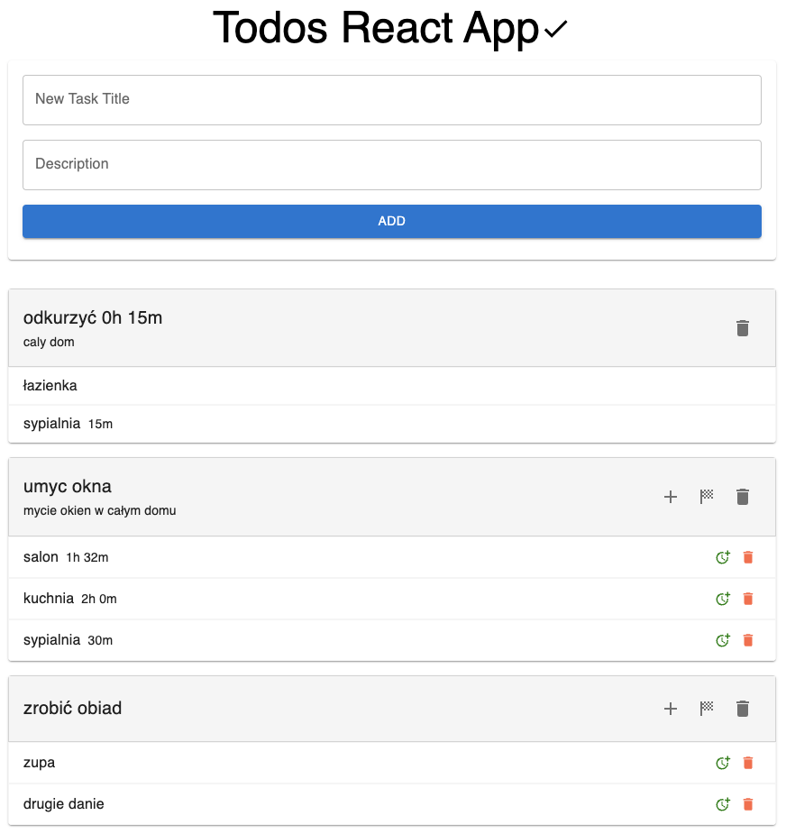
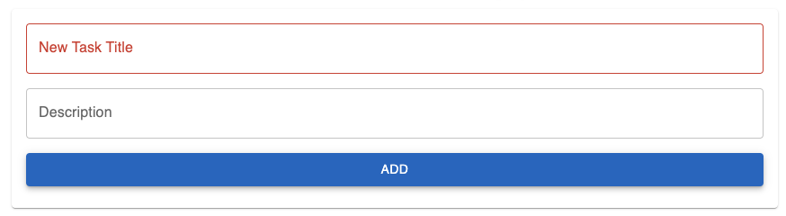
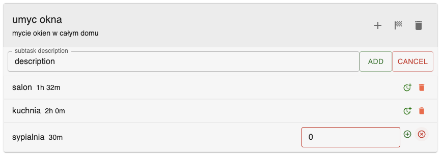

# Todo App

Simple React+TypeScript application that uses Material UI for its design. 
It uses Axios for HTTP requests and JSON Server for creating an API. 
It includes form validations to ensure that data entered by the user is correct and can be used by the application.

Hosted on [Firebase](https://todo-jm-b85fe.web.app/)

## Technologies

- React
- TypeScript
- Material UI
- Axios
- JSON Server


## Features

- Add and delete tasks
- Add and delete subtasks
- Time to complete tasks and subtasks
- Mark tasks as completed
- Form validations to ensure data entered by the user is correct

## Run Locally

```bash
  git clone git@github.com:jakubmadyda/todo_app.git
  cd todo_app
  npm install
  npm run dev
  npm run server
```

## Screenshots






